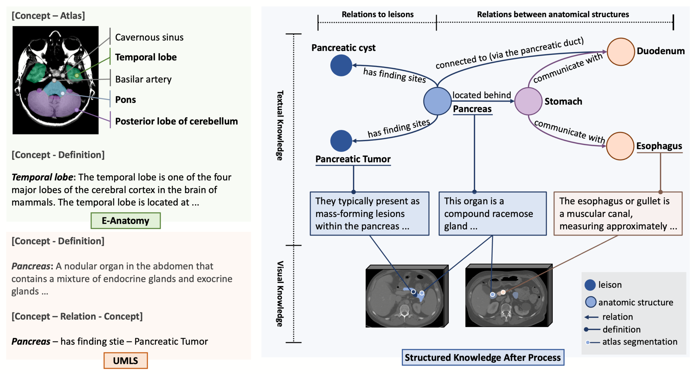
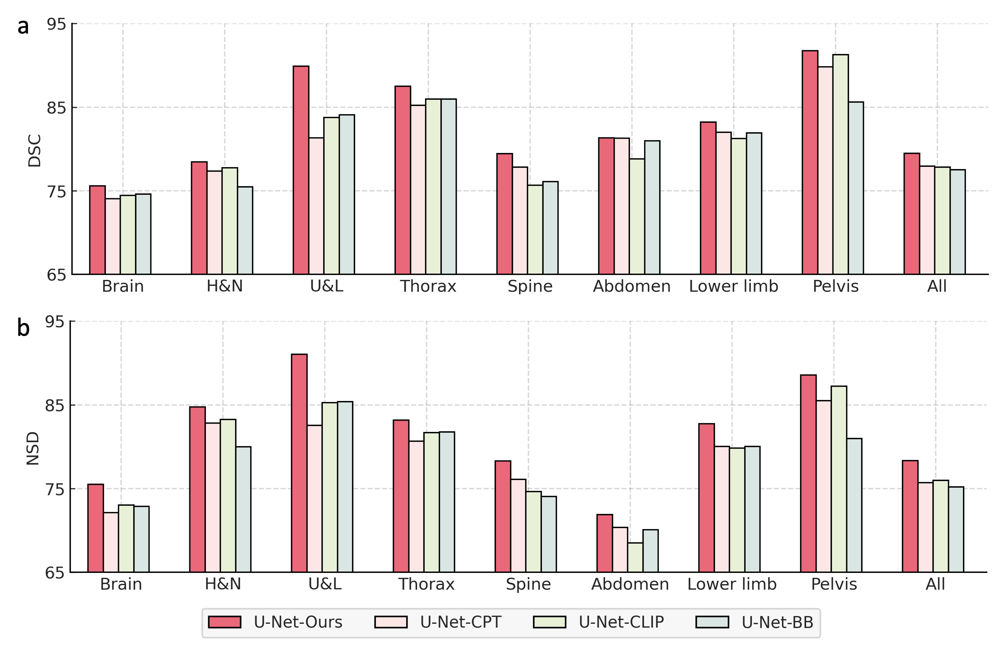

# SAT-Pretrain

This is the official repository to conduct knowledge enhancement pretraining in "One Model to Rule them All: Towards Universal Segmentation for Medical Images with Text Prompts".

We utilize textual and visual knowledge from multiple data source to build a multi-modal knowledge tree for human anatomy.



Through pretraining, the text encoder can better capture the characteristic of human anatomy terminologies in the embedding space, as well as their relationships. This can benefit the text-prompted segmentation, and potentially other tasks.



For more details, please refer to our [paper](https://arxiv.org/abs/2312.17183).

## Requirements
The requirements are basically the same as those in [SAT](https://github.com/zhaoziheng/SAT), so you can reuse the environment here.

The implementation of U-Net relies on a customized version of [dynamic-network-architectures](https://github.com/MIC-DKFZ/dynamic-network-architectures), to install it:
```
cd model
pip install -e dynamic-network-architectures-main
```

Some other key requirements:
```
torch>=1.10.0
numpy==1.21.5
monai==1.1.0 
transformers==4.21.3
nibabel==4.0.2
einops==0.6.1
positional_encodings==6.0.1
```

## Model Checkpoint:
We have provided several pretrained text encoders in [huggingface](https://huggingface.co/zzh99/SAT/Pretrain):
- A version pretrained only with the textual knowledge (`textual_only.pth`).
- A version further pretrained with [SAT-DS](https://github.com/zhaoziheng/SAT-DS/tree/main) (`multimodal_sat_ds.pth`). It can be used to reproduce results in our [paper](https://arxiv.org/abs/2312.17183).
- A version further pretrained with 10% training data from [CVPR 2025: FOUNDATION MODELS FOR TEXT-GUIDED 3D BIOMEDICAL IMAGE SEGMENTATION](https://www.codabench.org/competitions/5651/) (`multimodal_cvpr25.pth`). It's explicitly optimized for the challenge.

## For Text-prompted Segmentation
After downloading these pretrained text encoder, you can directly apply them to train a text-prompted medical segmentation. Pleas refer to the train guidance in [SAT](https://github.com/zhaoziheng/SAT).

## Train from Scratch:
If you try to do pretraining from scratch, please refer to the training scripts in `sbatch_script`.

## Citation
If you use this code for your research or project, please cite:
```
@arxiv{zhao2023model,
  title={One Model to Rule them All: Towards Universal Segmentation for Medical Images with Text Prompt}, 
  author={Ziheng Zhao and Yao Zhang and Chaoyi Wu and Xiaoman Zhang and Ya Zhang and Yanfeng Wang and Weidi Xie},
  year={2023},
  journal={arXiv preprint arXiv:2312.17183},
}
```
